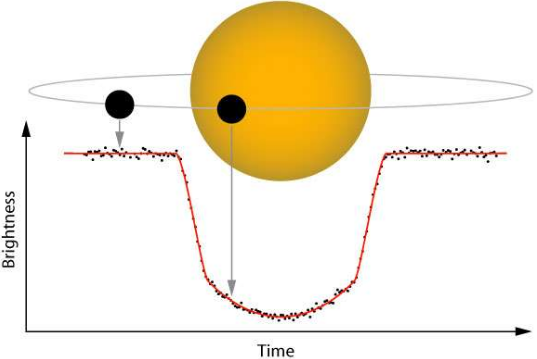

#Spark ML for exo-planets classification
---
Classification of exo-planets using Spark to implement logistic regression with elastic net penalisation.

## Synopsis
**Goal**  : Create a Binary classifier for exoplanets labeled "confirmed" or "false-positive".
  
**Context** : Exoplanets are planets rotating around other stars than the sun.

They are detected in two steps:
* A *Satellite* (Kepler) observes the stars and marks those whose luminosity curve shows a "hollow", which could indicate that a planet has passed (part of the light emitted by the star being obscured by the passage of the planet). This method of "transit" allows us to define candidate exoplanets, and to deduce the characteristics that the planet would have if it really existed (distance to its star, diameter, shape of its orbit, etc.).
* It is then necessary to validate or invalidate the candidates using another more expensive method, based on measurements of radial velocities of the star. Candidates are then classified as "confirmed" or "false-positive".

As there are about 200 billion stars in our galaxy, and therefore potentially as much (or even more) exoplanets, their detection must be automated to "scale up". The method of transits is already automatic (more than 22 million curves of luminosity recorded by Kepler), but not the confirmation of the candidate planets, hence the automatic classifier that we will build.

## Data
Data on exoplanets is public and available online (check the [link](http://exoplanetarchive.ipac.caltech.edu/index.html)). There are already 3388 exoplanets confirmed and about as many false positives, our classifier will be trained on these data. There is one exoplanet per line. The column of labels (what we are going to try to predict) is called "koi_disposition". The classifier will only use information from the brightness curves.

## Usage

To create jars: (from build.sbt folder)
```
sbt assembly
```

To launch Job, from spark-submit folder (spark bin):

For first Job:
```
./spark-submit --conf spark.eventLog.enabled=true --conf spark.eventLog.dir="/tmp" --driver-memory 3G --executor-memory 4G --class com.sparkProject.Job /Users/leonardbinet/Documents/Formation/Cours\ Telecom/T1_Spark_exo_planete/tp_spark/target/scala-2.11/tp_spark-assembly-1.0.jar
```
For machine learning JobML:
```
./spark-submit --conf spark.eventLog.enabled=true --conf spark.eventLog.dir="/tmp" --driver-memory 3G --executor-memory 4G --class com.sparkProject.JobML /Users/leonardbinet/Documents/Formation/Cours\ Telecom/T1_Spark_exo_planete/tp_spark/target/scala-2.11/tp_spark-assembly-1.0.jar /Users/leonardbinet/Documents/Formation/Cours\ Telecom/T1_Spark_exo_planete/Data/cleanedDataFrame.parquet
```

Where:
```/Users/leonardbinet/Documents/Formation/Cours\ Telecom/T1_Spark_exo_planete/tp_spark/target/scala-2.11/tp_spark-assembly-1.0.jar ```
needs to be replaced by your own JAR.

And
```/Users/leonardbinet/Documents/Formation/Cours\ Telecom/T1_Spark_exo_planete/Data/cleanedDataFrame.parquet```
needs to be replace by your own parquet file.

## Environment

 - IntelliJ / or Databricks for testing
 - Spark : ML library
 - Scala language


## Results

```
------------
SCORE
------------------

0.9872352138359732
+-----+----------+-----+
|label|prediction|count|
+-----+----------+-----+
|  1.0|       1.0|  216|
|  0.0|       1.0|   24|
|  1.0|       0.0|    7|
|  0.0|       0.0|  367|
+-----+----------+-----+

```

## Todo
